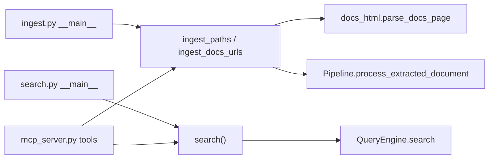

# Docs URL ingest + shared entrypoint functions

## You are correct about the architecture

Today there is significant duplication:

| Concern | [`ingest.py`](src/entrypoints/ingest.py) | [`search.py`](src/entrypoints/search.py) | [`mcp_server.py`](src/entrypoints/mcp_server.py) |
|---------|------------------------------------------|------------------------------------------|--------------------------------------------------|
| Mistral client + embedder | inline in `main()` | inline in `main()` | module-level `_mistral_client`, `_embedder` |
| `get_index()` | yes | yes | yes |
| Pipeline setup | yes (plain + OCR) | — | yes (duplicated) |
| `QueryEngine` | — | inline in `main()` | module-level `_query_engine` |
| Ingest logic | file/dir loop | — | `_ingest_local`, `_ingest_http` |

The MCP server should be a **thin adapter**: register tools, format responses for agents, keep navigation tools (`open`, `read`, `grep`, `navigate`) that are MCP-specific. Core search and ingest belong in the entrypoint modules.



## What we already have (no new research needed)

- **Extraction + chunking + citation metadata**: [`search_app/docs_html.py`](src/search_app/docs_html.py) — `parse_docs_page()` produces a `Document` with enriched chunks (`heading`, `citation_url`, `title`, `url`). Tested offline in [`tests/test_docs_html.py`](tests/test_docs_html.py).
- **Preview CLI**: [`preview_docs.py`](src/entrypoints/preview_docs.py) validates the pipeline end-to-end (no embed/index).
- **Embed + index API**: `Pipeline.process_extracted_document(document=...)` runs embedder + `store.index_document()` without re-extracting ([toolkit `pipeline.py`](.venv/lib/python3.12/site-packages/mistralai/search/toolkit/ingestion/pipelines/pipeline.py) line 168). Use a pass-through `CharacterTextSplitter(chunk_size=10_000_000)` so pre-split docs_html chunks are not re-split.
- **Index seam**: `get_index(collection_name)` from [`search_app/__init__.py`](src/search_app/__init__.py) — same as today.
- **Scope confirmed**: **docs.mistral.ai only** — validate host and reject others with a clear error.

## Implementation plan

### 1. Extract shared client/index helpers (small, in `search_app`)

Add a minimal helper module [`src/search_app/clients.py`](src/search_app/clients.py) (or functions in `search_app/__init__.py` if preferred to avoid a new file):

```python
def get_mistral_client() -> Mistral: ...
def get_embedder(client: Mistral | None = None) -> MistralEmbedder: ...
```

Both `ingest.py` and `search.py` import these instead of duplicating env reads. MCP imports the same helpers at startup.

### 2. Refactor [`search.py`](src/entrypoints/search.py)

Expose:

```python
@dataclass
class SearchHit:  # thin wrapper or use toolkit SearchResult directly
    ...

async def search(
    query: str,
    *,
    top_k: int = 5,
    collection_name: str | None = None,
    query_profile: str = "hybrid-search",
) -> list[SearchResult]: ...
```

- `main()` becomes: parse args → `asyncio.run(search(...))` → print results.
- Returns toolkit `SearchResult` objects (MCP formats them; CLI prints them).

### 3. Refactor + extend [`ingest.py`](src/entrypoints/ingest.py)

Expose:

```python
@dataclass(frozen=True)
class IngestSummary:
    total_chunks: int
    document_count: int
    collection_name: str
    sources: list[str]  # paths or URLs ingested

async def ingest_paths(
    paths: list[Path],
    *,
    collection_name: str | None = None,
) -> IngestSummary: ...

async def ingest_docs_urls(
    urls: list[str],
    *,
    collection_name: str | None = None,
    chunk_size: int = DEFAULT_CHUNK_SIZE,      # from docs_html
    chunk_max_size: int = DEFAULT_CHUNK_MAX_SIZE,
    chunk_overlap: int = DEFAULT_CHUNK_OVERLAP,
) -> IngestSummary: ...

async def ingest_uri(uri: str, **kwargs) -> IngestSummary:
    """Unified entry for MCP: file:// / local path / docs.mistral.ai https URL."""
```

**`ingest_docs_urls` flow** (per URL):

1. Validate `urlparse(url).netloc == "docs.mistral.ai"` (reject with clear error otherwise).
2. `page = await parse_docs_page(url)` — fetch + isolate + extract + split + enrich.
3. Build a docs pipeline once (module-level or lazy singleton):
   - `loader=None`, `extractor=HTMLExtractor()` (unused), pass-through `CharacterTextSplitter`, `MistralEmbedder`, `get_index(...)`.
4. `await docs_pipeline.process_extracted_document(document=page.document)`.
5. Accumulate chunk counts; print progress per URL in CLI `main()`.

**`ingest_paths`**: move existing file/dir + plain-text vs OCR pipeline logic from current `main()` unchanged in behavior.

**CLI changes** (mutually exclusive modes):

```bash
# existing
python -m entrypoints.ingest sample_data/hello.txt
python -m entrypoints.ingest sample_data/

# new
python -m entrypoints.ingest --url https://docs.mistral.ai/studio/conversations/chat-completion
python -m entrypoints.ingest --url URL1 --url URL2
```

Update [`Makefile`](Makefile) with e.g. `make ingest-docs urls="URL1 URL2"`.

### 4. Thin out [`mcp_server.py`](src/entrypoints/mcp_server.py)

Remove duplicated pipeline/search setup. At import time keep only what MCP-specific tools need:

- `_vector_store` / `_navigable_store` (navigation tools still need direct store access)
- `_embedder` only if navigation tools need it (they don't — can drop)

Replace tool bodies:

```python
from entrypoints.search import search as run_search
from entrypoints.ingest import ingest_uri

@mcp.tool()
async def search(query: str, top_k: int = 5) -> list[dict]:
    results = await run_search(query, top_k=top_k)
    return _format_chunks(results)

@mcp.tool()
async def ingest(uri: str) -> str:
    summary = await ingest_uri(uri)
    return f"Indexed {summary.total_chunks} chunks from {summary.document_count} source(s) into '{summary.collection_name}'."
```

**MCP ingest routing** (inside `ingest_uri`):
- `https://docs.mistral.ai/...` → `ingest_docs_urls([url])`
- local path / `file://` → `ingest_paths([path])`
- other `https://` → **reject** with message pointing to docs.mistral.ai (per scope decision; removes the old generic OCR HTTP path from MCP — if you still need PDF URLs via MCP later, that can be a separate `--ocr-url` path)

`delete` stays in MCP (or optionally move to `ingest.py` as `delete_source(source_id)` for symmetry — low priority).

### 5. Tests

- **Unit** (no Vespa): test `ingest_docs_urls` host validation rejects non-docs URLs.
- **Offline**: test that `ingest_docs_urls` with injected HTML (monkeypatch `fetch_html` or pass through `parse_docs_page(html=...)`) produces expected chunk metadata before embed — similar to existing `test_docs_html.py`.
- **Optional integration**: extend round-trip or add `test_ingest_docs_url.py` gated on `make setup-vespa` (needs network for live fetch + `MISTRAL_API_KEY` for embed). Keep the existing offline tests as the primary safety net.
- **MCP**: existing [`tests/test_mcp_tools.py`](tests/test_mcp_tools.py) should still pass (navigation tools unchanged); no change to import-time key fixture.

### 6. Docs

Update [`README.md`](README.md) ingest section with `--url` examples and note that MCP `ingest` uses the same functions.

## Files touched

| File | Change |
|------|--------|
| [`src/search_app/clients.py`](src/search_app/clients.py) | new — shared Mistral client/embedder factory |
| [`src/entrypoints/search.py`](src/entrypoints/search.py) | extract `search()`; thin CLI |
| [`src/entrypoints/ingest.py`](src/entrypoints/ingest.py) | extract `ingest_paths`, `ingest_docs_urls`, `ingest_uri`; add `--url`; thin CLI |
| [`src/entrypoints/mcp_server.py`](src/entrypoints/mcp_server.py) | import and delegate; remove ~80 lines of duplication |
| [`Makefile`](Makefile) | optional `ingest-docs` target |
| [`README.md`](README.md) | document new URL ingest |
| [`tests/`](tests/) | host validation + optional integration test |

## Out of scope (for now)

- Re-ingest dedup (delete-by-`source_id` before re-indexing same URL) — worth a follow-up; Vespa will upsert by document id but stale chunks from a prior split config could linger.
- Workflow activity in `src/examples/workflows/` — can import `ingest_paths` later.
- Changing Vespa schema — `citation_url` etc. live in chunk `metadata` JSON blob; no migration needed.
