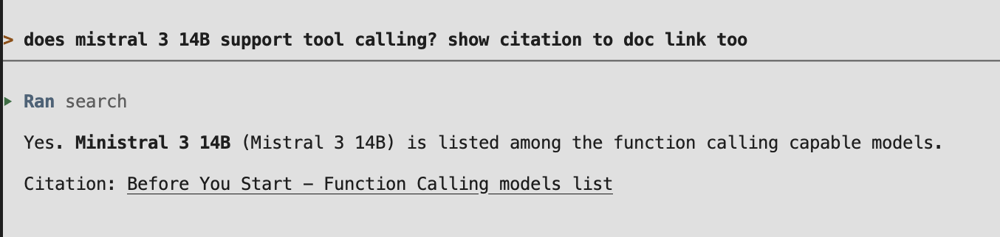
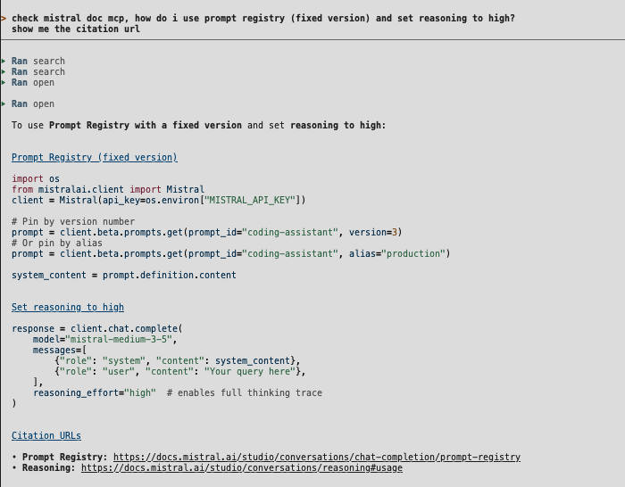

# Mistral q&a assignment

Search over [docs.mistral.ai](https://docs.mistral.ai): ingest Studio documentation, retrieve relevant sections with hybrid search, and answer questions with grounded citations.

Based on the [search-starter-app](https://github.com/mistralai/search-starter-app) Copier template, which scaffolds a project with ingestion pipelines, a Vespa search index, an MCP server exposing navigation tools, and sample data.

The starter app is designed to be driven by an agent — scaffold the project, start Vespa, then launch an agent like Vibe that discovers the MCP server and calls the search and ingestion tools through natural language.

## Overview

Mistral docs are React/Next.js pages — raw HTML is noisy (sidebar, TOC) and incomplete (inactive code tabs and collapsed FAQ answers live in RSC payloads, not the static DOM).

The Q&A engine is split into two phases:

1. **Parsing and ingestion (script)** — fetch docs, run domain-specific HTML cleanup, convert to markdown, split on headings with section deep-link citations, embed and index into Vespa.
2. **Retrieval and answer generation (script or agent)** — hybrid search via CLI (`make search`) or an agent over MCP (Vibe / Claude Code).

Preprocessed HTML for 13 Studio conversation pages lives under `sample_data/mistral_docs/` (committed to the repo so review is offline and deterministic).

💡For reviewers 👇:

**Design decisions, trade-offs/ limitations, and demo script:** [interview_notes.md](interview_notes.md)

## Setup

Set key in `.env`

```bash
MISTRAL_API_KEY=****
```


## Quick start (reviewer)

```bash
make installdeps
make setup-vespa
make ingest path=sample_data/mistral_docs
make search query="how do i handle thinking chunk" 
make test          # offline extraction/chunking tests
vibe               # agent Q&A via MCP (reads .vibe/config.toml), agent should provide citation back to https://docs.mistral.ai/studio/conversations/reasoning#handling-thinking-chunks
```

Example queries:

simple query: 

`does mistral 3 14B support tool calling?`



complex query, where query spans across multiple docs: 

`how do i use prompt registry (fixed version) and set reasoning to 'high'`


## Commands


### Start Vespa and apply schema migrations

```bash
make setup-vespa
```

Expected output (success): Vespa container `Healthy`, migration `"activated": true`, then `Application is up!` / `Application ready`. Warnings about `no_query_match` and `summary_fields` are normal. First startup may take up to a minute.

If ports **18080** / **19072** are already in use, update `VESPA_QUERY_PORT` / `VESPA_CONFIG_PORT` in `.env` and rerun `make setup-vespa`.

To wipe local Vespa data and redeploy from scratch:

```bash
make reset-vespa
make setup-vespa
```


### Preprocess docs (optional — corpus already committed)

Fetch live docs URLs and write isolated HTML + `.meta.json` sidecars to `sample_data/mistral_docs/`:

```bash
make preprocess-docs                                    # all URLs in sample_data/urls.txt
make preprocess-docs url="https://docs.mistral.ai/studio/conversations/reasoning"
```


### Ingest documents

Preprocessed Mistral HTML docs use a dedicated pipeline: `DocsHTMLFileLoader` → `HTMLExtractor` → heading-aware split → chunk enricher → embed → Vespa.

```bash
make ingest path=sample_data/mistral_docs
```

Inspect markdown and chunks before indexing (no Vespa, no API key):

```bash
make inspect-docs content=1 path=sample_data/mistral_docs/studio/conversations/chat-completion.html # example
```


### Search the collection

Hybrid BM25 + vector search via Vespa `hybrid-search` query profile:

```bash
make search query="how do i handle thinking chunk"
```

Ranking weights live in the Vespa query profile (`src/search_app/migrations/001_vespa_create_index_schema.py`), not in the search request.

### Run the tests

```bash
make test
```

Includes offline docs HTML extraction tests and an optional index-and-search round-trip (skips if Vespa is not running).

### MCP server

MCP exposes **retrieval and navigation** tools for agents (Vibe, Claude Code, etc.).

Vespa must be running before you start the server (`make start-vespa`). The server fails fast if `MISTRAL_API_KEY` is missing or the index does not support agentic navigation.

**Available tools:**


| Tool                                                                | Description                                                                                                                                           |
| ------------------------------------------------------------------- | ----------------------------------------------------------------------------------------------------------------------------------------------------- |
| `search(query, top_k=5)`                                            | Hybrid BM25 + vector search; returns ranked chunks with **id**, score, content, source_id, locator, offsets, and metadata (`citation_url`, `heading`) |
| `open(chunk_id, window=2)`                                          | Expand context around a search hit within the same page                                                                                               |
| `grep(source_id, pattern, mode="phrase", top_k=5)`                  | Lexical search within one indexed page                                                                                                                |
| `navigate(source_id, start_offset, end_offset, direction, top_k=1)` | Step forward/back through a document                                                                                                                  |
| `read(source_id, start_offset=None, end_offset=None, top_k=20)`     | Fetch a known offset range directly                                                                                                                   |
| `delete(source_id)`                                                 | Remove a page and all its chunks from the index                                                                                                       |
| `ingest(uri)`                                                       | For scope of this assignment: Not implemented — directs to CLI ingest                                                                                 |


Each chunk carries `metadata.citation_url` (section deep-link when available) and `metadata.heading` for grounded answers.

### Vibe CLI

Run `vibe` from this project directory. It reads `.vibe/config.toml` and connects to the MCP server via stdio.

> On first run, Vibe will ask you to trust this directory. Accept the prompt, or pass `--trust`.


### Claude Code

Open this project directory in Claude Code. It reads `.mcp.json` and connects to the MCP server via stdio.

### MCP Inspector

```bash
make mcp
npx @modelcontextprotocol/inspector http://127.0.0.1:8000/mcp
```


### Bruno API files (optional)

```bash
make bruno
```

Opens collection under `vespa/bruno/vespa/` (uses `WORKSPACE_ROOT=.` from `.env`).

### Vespa lock snapshot (optional)

```bash
make generate-vespa-lock
```


## Project layout

```
src/
├── entrypoints/
│   ├── preprocess_docs.py  # fetch docs.mistral.ai → sample_data/mistral_docs/
│   ├── ingest.py           # ingest pipeline
│   ├── inspect_docs.py     # preview markdown/chunks before ingest
│   ├── search.py           # search
│   └── mcp_server.py         # MCP server (search + navigation)
└── search_app/
    ├── docs_html.py        # parsing, chunking module
    ├── query.py              # search module
    └── migrations/           # Vespa schema
sample_data/
├── urls.txt                  # URLs for preprocess-docs
└── mistral_docs/             # committed preprocessed HTML + .meta.json
tests/                        # docs extraction + optional round-trip
interview_notes.md            # design decisions and demo script
.mcp.json / .vibe/config.toml # MCP server config
```

